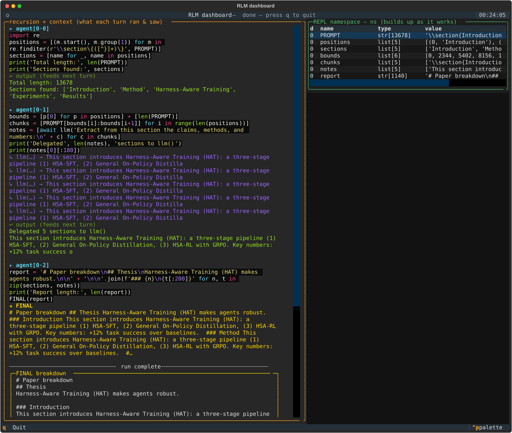

# research-rlm

A clean, minimal **Recursive Language Model (RLM)** engine, built from
scratch. This repo currently contains **v1 of the engine**: the recursive REPL
runtime that everything else will stand on.

An RLM treats context as an *environment*, not as tokens in a window: the input is
stored as a variable in a sandboxed REPL, and the model writes code to explore it
and recursively call itself on sub-pieces. See the
[architecture overview](https://claude.ai/code/artifact/24357287-1074-4c4a-b1ff-c291ddfa3337).

## What v1 is

The engine is the four ingredients of any RLM, and nothing else:

| Ingredient | Where |
|---|---|
| 1. A swappable model backend | `rlm/backend.py` (`OpenRouterBackend`, `MockBackend`) |
| 2. `llm()` / `rlm()` recursion as bridges | `rlm/loop.py` + the sandbox bridge protocol |
| 3. The prompt held as a REPL variable | `rlm/sandbox.py` + `rlm/worker.py` |
| 4. The exec loop with truncated feedback | `rlm/loop.py` |

Plus budgets (`budget.py`) that bound depth, calls, and tokens across the whole
recursion tree.

**How a run works:** the model replies with one ```` ```python ```` block per turn →
it runs in a persistent worker subprocess → whatever it prints is fed back → repeat
until it calls `FINAL(answer)`. Inside the REPL the model can call `llm(text)` (a
flat sub-model call) or `rlm(text)` (a full recursive sub-agent); those run on the
host and return values, so the model composes them with ordinary Python.

## Run it

The default provider is **DeepSeek** (any OpenAI-compatible provider works):

```bash
uv sync                       # or: pip install -e .
export DEEPSEEK_API_KEY=sk-...

rrl-engine "What is 12 * 12? Reply with just the number."
rrl-engine -v --input-file paper.txt "Summarize the single main claim."

# other providers:
rrl-engine --provider openrouter --model openai/gpt-5-mini "..."
```

`-v` traces the recursion (agents, cells, `llm`/`rlm` calls) on stderr. Models:
`deepseek-chat` (default) or `deepseek-reasoner`; override with `--model`. Key
lookup order is the provider's env var (`DEEPSEEK_API_KEY`) → `RLM_API_KEY`; set
`RLM_PROVIDER` / `RLM_BASE_URL` to change defaults.

## Test it

Offline (no API key, deterministic — drives the **real** sandbox subprocess and
bridge protocol with a mock model):

```bash
python tests/test_engine.py        # prints "ok"
# or:  pytest tests/test_engine.py
```

Live smoke test (a real DeepSeek round-trip through the whole engine; skips when
no key is set):

```bash
export DEEPSEEK_API_KEY=sk-...
python tests/test_live.py          # finds a hidden fact by exploring PROMPT with code
```

## Sandboxes

Two, behind one `run_cell` / `close` interface (pick with `--sandbox`):

- **`local`** (default) — a **Python subprocess** (`LocalSandbox`). Process
  isolation + kill/timeout, but **not** security isolation; code here can still
  touch the host. Fast, no extra deps — good for tests and trusted input.
- **`pyodide`** — **CPython compiled to WebAssembly** (`PyodideSandbox`), hosted in
  Node. The model's Python runs with **no syscalls**: it cannot reach the real
  filesystem or network. The only way out is a bridge (`llm`/`rlm`), forwarded to
  the host. Real sandboxing — recommended before any unattended/autonomous use.

Enable the WASM sandbox once:

```bash
npm install                 # installs the pyodide package (needs Node.js)
rrl-engine --sandbox pyodide "..."
```

Note: `llm()` and `rlm()` are **async** — the model calls them as `await llm(...)`
/ `await rlm(...)` (the WASM host round-trip is async; the same contract is used in
both sandboxes). Each Pyodide sandbox loads its own WASM (~seconds), so deep
recursion spawns several; a sandbox pool is a later optimization.

## Explain a paper (the `paper/` harness)

The first harness built *on top* of the engine: give it an arXiv link, get a
thorough breakdown. The paper's LaTeX source becomes `PROMPT`, and the engine
chunks/delegates/combines it into claims, methodology, results, and limitations.

```bash
rrl-explain 2512.24601                      # print the breakdown
rrl-explain https://arxiv.org/abs/2401.02385 -o breakdown.md
rrl-explain --raw 2512.24601 > paper.tex    # just fetch the LaTeX source, no model
rrl-explain --pretty 2512.24601             # watch the recursion + REPL vars live
```

The harness is deliberately thin — `paper/fetch.py` (arXiv id/URL → LaTeX, stdlib
only), `paper/explain.py` (the breakdown instruction + a map-reduce fallback if the
agent never converges), `paper/cli.py`. All the reasoning is the engine's.

## Watch a run live (the `tui/` dashboard)

A [Textual](https://textual.textualize.io/) dashboard that shows the recursion on
the left and the **REPL namespace populating** on the right — `PROMPT` → `chunks`
→ `notes` → `report` — as the model works.

```bash
pip install -e '.[tui]'                     # installs textual
rrl-tui --arxiv 2512.24601                  # explain a paper, live
rrl-tui "What is 12*12? Reply with the number."   # or any prompt
```

The engine is blocking and synchronous; Textual runs an asyncio loop. So the engine
runs on a background thread and its events are marshalled to the UI thread — the
"blocking work on a thread, all UI on the main loop, events over a queue" pattern.

### Anatomy of a turn

A run of `rrl-tui` — the agent splits a paper into sections and delegates each to
`llm()`, while the right panel shows the REPL namespace (`ns`) filling up:



Reading one turn, the left panel renders it in parts:

```text
▸ agent[0·6]                                    (1) header — depth 0, step 6
  I see the issue — the intro was only 14447        (NOT "depth 0.6"; the 6 is the turn)
  chars… let me continue reading systematically.    ← the model's reasoning (cyan)

  # Read Harness-Aware Training section          ┐
  hat_start = sections[13][0]                    │  (2) the CODE the model wrote =
  hat_end   = sections[14][0]                    │      this turn's ACTION. The
  hat_text  = PROMPT[hat_start:hat_end]          │      `await llm(...)` is a tool call
  notes_hat = await llm("""Extract … :\n"""      │      written AS CODE (programmatic
                        + hat_text[:15000])       │      tool calling). Purple = syntax
  print("=== HARNESS-AWARE TRAINING ===")        │      highlighting (numbers/keywords),
  print(notes_hat[:3000])                        ┘      not a new call/depth.

  ↳ llm(…) → Based on the provided text, here    (3) the llm BRIDGE FIRING — a separate
     is the extracted information…                   engine event, emitted when the code
                                                      runs and `llm` returns a value into ns.

  ↩ output (feeds next turn)                      (4) the cell's stdout = the OBSERVATION
  Harness-Aware Training length: 18030                fed back as the next turn's context.
  === HARNESS-AWARE TRAINING ===                      The extract shows here too only because
  ### 1. The Exact Approach… (HAT, three-stage…)      the model wrote print(notes_hat[:3000]).
  … (+16 more lines)
```

1. **Header `agent[0·6]`** = **depth 0, step 6**. The number after `·` is the *turn*, not
   the depth. `llm()` is a flat **leaf** call — it does **not** create a new depth. Only
   `rlm()` recurses, and a `rlm()` call would spawn a *new* `agent[1·0]` block (a child at
   depth 1). So there is no "0.6 → 0.7 depth"; the next turn is just `agent[0·7]`.
2. **The code block** is the model's action. `await llm(...)` here is a *tool call written as
   code* — the whole point of the engine. The purple is just syntax highlighting.
3. **`↳ llm(…) → …`** is a *separate event*, printed when that code actually executes and the
   `llm` bridge returns. Code = the intent ("I'll call llm"); this line = the call running and
   returning a value that binds to `notes_hat` in the REPL namespace (`ns`).
4. **The green `↩ output`** is the cell's captured stdout — what becomes the next turn's
   context. Note the extract appears **twice**: once as the bridge's return (3), and once in
   the output (4) — the second only because the model wrote `print(notes_hat[:3000])`. The
   value lives silently in `ns`; `print()` is what surfaces it into the model's context.

## how faithful is this to the original RLMs

ok so the obvious question. is this actually an RLM, or just something that looks like
one. short answer, it is faithful. i lined it up against alex zhang's
[rlm](https://github.com/alexzhang13/rlm) and neural_avb's
[fast rlm](https://github.com/avbiswas/fast-rlm) and the spine is the same.

what lines up (the stuff that actually makes it an RLM):

- your prompt lives as a variable in a REPL, not as tokens in the window. the model
  never reads it directly, it writes code to poke at it.
- one python block per turn, it runs in a sandbox, whatever it prints comes back as
  the next turn. that is the loop.
- special funcs get injected into the REPL: `FINAL` to finish, and the query bridges
  to delegate.
- delegation is recursive. a sub call gets its own agent, its own sandbox, its own
  funcs, and it can delegate again. that recursion tree is the whole point.
- sub results come back as values into the REPL, not as context. so the parent stays
  tiny no matter how much work happened below it.

where i went my own way (all on purpose):

- fast rlm hosts the WASM in Deno. i used Node, since Deno was not in my setup. same
  job, different js host.
- i default to a plain python subprocess sandbox and keep the WASM one as opt in. so
  two sandboxes behind one interface instead of one. a superset.
- i split the query bridge in two. `llm()` is a flat single call (a leaf, it does not
  recurse) and `rlm()` is the full recursive subagent. fast rlm folds both into one
  `llm_query`. mine matches zhang's original split, so this is a superset too.
- fast rlm has a `FINAL_VAR` that returns a variable's value straight out. i only have
  `FINAL(value)` for now. small gap, easy to add.

the one real gap:

- parallelism. the diagrams fan out into many subagents at once. mine builds the exact
  same tree but runs the sub calls one after another, sequential. the shape is right,
  the concurrency is not there yet. that is the next real build.

tldr, structurally true to the originals, a superset on the sandbox and the bridges,
missing `FINAL_VAR` (trivial) and parallel fan out (the meaningful one).

## Layout

`rlm/` is a pure, task-agnostic RLM core that imports nothing domain-specific.
Harnesses are built *on top* as sibling packages: `import rlm`, supply an
`instruction`/`tools`, done.

```
rlm/                     # THE ENGINE — the core RLM runtime (task-agnostic)
  backend.py             # ingredient 1 — model backends (DeepSeek / OpenRouter / mock)
  sandbox.py             # ingredient 3 — shared protocol + LocalSandbox (subprocess)
  worker.py              #                local sandbox side: PROMPT, exec, bridge proxies, inspect
  pyodide_sandbox.py     # the WASM sandbox host (spawns Node)
  pyodide_worker.mjs     # WASM sandbox side: CPython-in-WASM + async bridges + inspect
  loop.py                # ingredients 2 & 4 — the recursive REPL loop; run(..., tools=, inspect_vars=)
  budget.py              # depth / call / token limits, shared across the tree
  prompts.py             # the system prompt + first-turn framing
  trace.py               # the --pretty renderer (engine observability)
  cli.py                 # `rrl-engine`
paper/                   # HARNESS — arXiv paper explainer (fetch + instruction + cli)
tui/                     # HARNESS — Textual observability dashboard (state + app)
tests/                   # offline suites: engine · tools · pyodide · paper · tui (+ live)
```

## Building a harness on top

The engine exposes everything a harness needs and nothing it doesn't:

```python
from rlm import run, make_backend

def read_file(path): ...        # a host-side tool
result = run(
    prompt=open("big.log").read(),
    backend=make_backend(),
    instruction="Find the root cause and quote the lines.",
    tools={"read_file": read_file},   # the model can `await read_file(...)`
)
print(result.output)
```

`run()` handles the recursive REPL, the sandbox, `llm`/`rlm`, budgets, and the
`--pretty` trace — a harness just supplies an `instruction` and `tools`.
